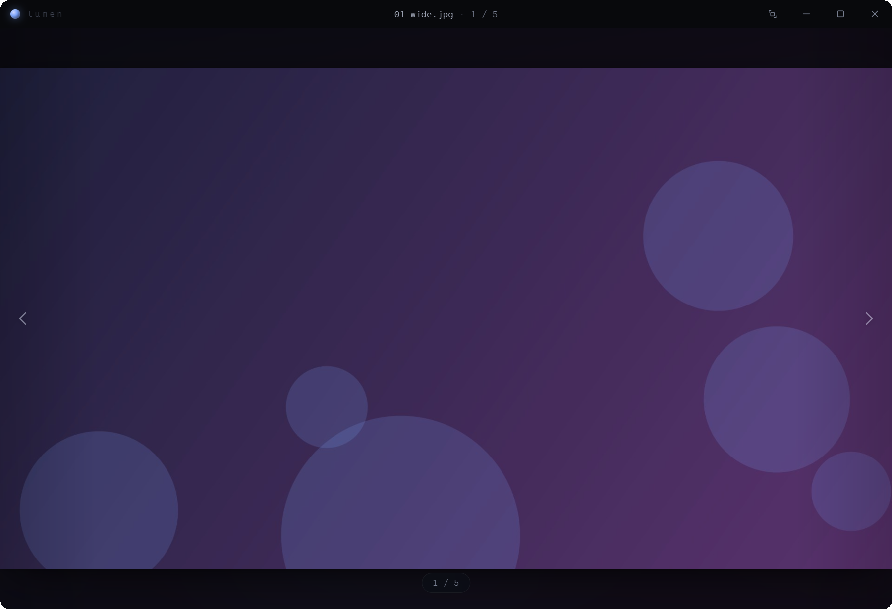

<div align="center">

# Lumen

**Un visor de imágenes dark, frameless y ultraminimalista para Windows.**

El reemplazo liviano del visor de fotos: abre al instante, sin distracciones. Un solo `.exe` portable.




</div>

---

## ✨ Qué es

**Lumen** es un visor de imágenes que se quita del medio: puro contenido, cromo que se autooculta,
zoom al cursor suave y navegación con crossfade. Una sola ventana **WebView2 sin marco del sistema**
(la barra de título la dibuja la página); los bytes de cada imagen se sirven desde un servidor HTTP
local. **Funciona 100% offline.**

## 🖼️ Formatos

Nativos del navegador, servidos crudos (rápido, con _range requests_):

> `jpg` · `jpeg` · `png` · `apng` · `gif` · `webp` · `avif` · `bmp` · `ico` · `svg`

Y los que el navegador no entiende se **decodifican en Go al vuelo**:

> `tif` · `tiff`

## 🎛️ Características

- **Ajustar ventana a la imagen** o **conservar el tamaño**: un toggle en la barra de título, recordado entre sesiones.
- **Zoom al cursor** con la rueda, paneo al arrastrar, doble-clic para alternar ajuste / detalle.
- **Navegación por carpeta** con orden natural (`foto2` antes que `foto10`) y precarga de vecinas.
- **Instancia única**: la 1ª ventana queda viva; cada `lumen.exe ` siguiente abre en **~0.3 s**.
- **Arrastrar y soltar**, pantalla completa, esquinas redondeadas y borde oscuro nativos de Windows 11.
- Arranque sin _flash_ ni _ghosting_: la ventana nace frameless + oscura desde el primer pixel.

## ⌨️ Atajos

| Tecla                 | Acción                       |
|-----------------------|------------------------------|
| `←` / `→` / `Espacio` | Imagen anterior / siguiente  |
| `rueda`               | Zoom al cursor               |
| `doble-clic`          | Ajuste ↔ detalle             |
| `+` / `-` / `0`       | Zoom in / out / ajustar      |
| `F` / `F11` / `Esc`   | Pantalla completa            |
| `Ctrl O`              | Abrir                        |

## 📦 Instalación

> Requiere [**Go**](https://go.dev) 1.24+ para compilar y el **runtime de WebView2** (viene de fábrica en Windows 11).

```powershell
git clone https://github.com/agustinyarrus/lumen.git
cd lumen
.\build.ps1      # compila lumen.exe (release, sin consola, con icono)
.\install.ps1    # instala en Program Files + Menú de Inicio y lo deja en "Abrir con" (admin)
```

`.\install.ps1 -Uninstall` revierte. O simplemente:

```powershell
lumen.exe foto.jpg
```

## 🏗️ Arquitectura

| Archivo         | Rol                                                                      |
|-----------------|--------------------------------------------------------------------------|
| `main.go`       | Host frameless + servidor HTTP local + instancia única + ajuste a imagen |
| `config.go`     | Preferencias persistentes (`%AppData%\Lumen\config.json`)                |
| `winapi.go`     | Diálogo nativo de apertura, pantalla completa, área útil del monitor      |
| `webview_bg.go` | Fondo oscuro del `about:blank` de WebView2 (anti-flash)                  |
| `ui/`           | HTML + CSS + JS embebidos (`//go:embed`)                                 |

## 📄 Licencia

MIT © Agustín Yarrus — ver [LICENSE](LICENSE).
